# 小说转视频生成系统 - 架构设计文档

## 1. 项目概述

本项目是一个基于混合方案的小说转视频自动化生成框架，能够将小说文本自动转换为带配音和字幕的视频。系统采用模块化设计，支持断点续传、并行处理和多种风格预设。

### 1.1 核心特性

- **智能分镜生成**: 使用LLM自动分析小说内容，提取角色信息并生成分镜脚本
- **多风格图像生成**: 通过ComfyUI + Z-Image-Turbo (阿里通义6B参数模型) 生成动漫、写实、国风等多种风格的场景图
- **AI视频生成**: 集成即梦AI/可灵AI远端API，将静态图像转换为动态视频
- **智能配音**: 支持CosyVoice和Edge TTS，为不同角色分配不同音色
- **自动合成**: 使用FFmpeg进行视频拼接、音频混合和字幕烧录
- **断点续传**: 完整的状态管理，支持任务中断后恢复
- **Web界面**: 基于Gradio的可视化操作界面

### 1.2 技术栈

| 组件 | 技术选型 | 用途 |
|------|----------|------|
| 语言 | Python 3.10+ | 主开发语言 |
| LLM | Ollama + Qwen2.5 | 分镜生成、角色提取 |
| 图像生成 | ComfyUI + Z-Image-Turbo | 场景图/角色设计图生成 (4步快速生成) |
| 视频生成 | 即梦AI / 可灵AI | 图生视频 (远端API) |
| TTS | CosyVoice / Edge TTS | 语音合成 |
| 视频合成 | FFmpeg | 视频拼接、音频混合 |
| Web界面 | Gradio | 可视化操作界面 |
| 配置管理 | Pydantic + YAML | 类型安全的配置 |
| 日志 | Loguru | 结构化日志 |

---

## 2. 系统架构图

### 2.1 整体架构

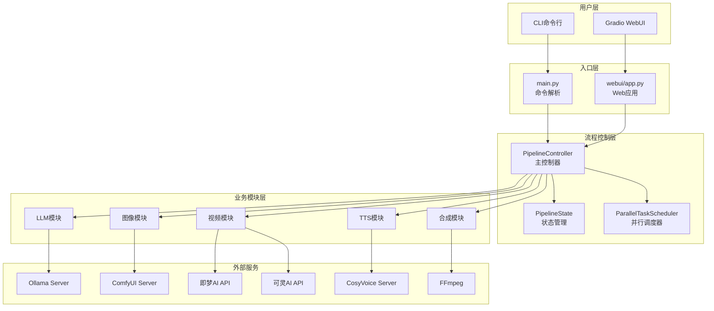
```mermaid
graph TB
    subgraph "用户层"
        CLI[CLI命令行]
        WebUI[Gradio WebUI]
    end

    subgraph "入口层"
        Main[main.py<br/>命令解析]
        WebApp[webui/app.py<br/>Web应用]
    end

    subgraph "流程控制层"
        Controller[PipelineController<br/>主控制器]
        State[PipelineState<br/>状态管理]
        Scheduler[ParallelTaskScheduler<br/>并行调度器]
    end

    subgraph "业务模块层"
        LLM[LLM模块]
        Image[图像模块]
        Video[视频模块]
        TTS[TTS模块]
        Compose[合成模块]
    end

    subgraph "外部服务"
        Ollama[Ollama Server]
        ComfyUI[ComfyUI Server]
        JimengAPI[即梦AI API]
        KlingAPI[可灵AI API]
        CosyVoice[CosyVoice Server]
        FFmpeg[FFmpeg]
    end

    CLI --> Main
    WebUI --> WebApp
    Main --> Controller
    WebApp --> Controller
    
    Controller --> State
    Controller --> Scheduler
    Controller --> LLM
    Controller --> Image
    Controller --> Video
    Controller --> TTS
    Controller --> Compose

    LLM --> Ollama
    Image --> ComfyUI
    Video --> JimengAPI
    Video --> KlingAPI
    TTS --> CosyVoice
    Compose --> FFmpeg
```

### 2.2 数据流架构

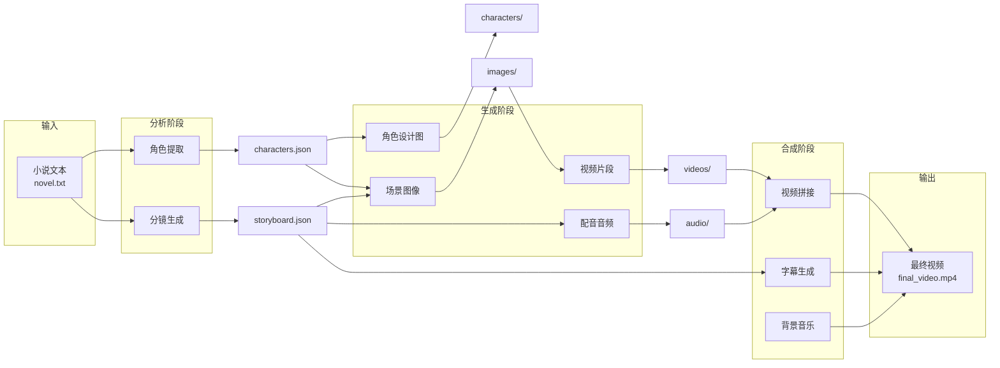
```mermaid
flowchart LR
    subgraph "输入"
        Novel[小说文本<br/>novel.txt]
    end

    subgraph "分析阶段"
        CharExtract[角色提取]
        Storyboard[分镜生成]
    end

    subgraph "生成阶段"
        CharDesign[角色设计图]
        SceneImg[场景图像]
        Audio[配音音频]
        VideoClip[视频片段]
    end

    subgraph "合成阶段"
        Merge[视频拼接]
        Subtitle[字幕生成]
        BGM[背景音乐]
    end

    subgraph "输出"
        FinalVideo[最终视频<br/>final_video.mp4]
    end

    Novel --> CharExtract
    Novel --> Storyboard
    CharExtract --> characters.json
    Storyboard --> storyboard.json
    
    characters.json --> CharDesign
    characters.json --> SceneImg
    storyboard.json --> SceneImg
    storyboard.json --> Audio
    
    CharDesign --> characters/
    SceneImg --> images/
    Audio --> audio/
    
    images/ --> VideoClip
    VideoClip --> videos/
    
    videos/ --> Merge
    audio/ --> Merge
    storyboard.json --> Subtitle
    
    Merge --> FinalVideo
    Subtitle --> FinalVideo
    BGM --> FinalVideo
```

---

## 3. 目录结构

```
xiaoshuo_video/
├── config/                     # 配置文件目录
│   ├── settings.yaml          # 全局配置
│   ├── prompts/               # LLM提示词模板
│   └── comfyui_workflows/     # ComfyUI工作流JSON
│
├── src/                       # 源代码目录
│   ├── main.py               # CLI入口
│   ├── exceptions.py         # 自定义异常
│   │
│   ├── llm/                  # LLM模块
│   │   ├── client.py         # Ollama客户端
│   │   ├── character_extractor.py  # 角色提取器
│   │   ├── storyboard_generator.py # 分镜生成器
│   │   ├── chapter_splitter.py     # 章节分割器
│   │   ├── json_parser.py    # JSON解析工具
│   │   └── prompt_manager.py # 提示词管理
│   │
│   ├── image/                # 图像模块
│   │   ├── comfyui_client.py # ComfyUI客户端
│   │   ├── scene_generator.py # 场景图生成器
│   │   └── character_designer.py # 角色设计器
│   │
│   ├── video/                # 视频API模块
│   │   ├── api_client.py     # 抽象基类
│   │   ├── jimeng.py         # 即梦AI客户端
│   │   └── kling.py          # 可灵AI客户端
│   │
│   ├── tts/                  # TTS模块
│   │   ├── cosyvoice_client.py # CosyVoice客户端
│   │   ├── edge_tts_client.py  # Edge TTS客户端
│   │   └── voice_manager.py  # 音色管理器
│   │
│   ├── compose/              # 视频合成模块
│   │   ├── video_composer.py # 视频合成器
│   │   ├── subtitle.py       # 字幕生成器
│   │   └── audio_mixer.py    # 音频混合器
│   │
│   ├── pipeline/             # 流程控制模块
│   │   ├── controller.py     # 主控制器
│   │   ├── state.py          # 状态管理
│   │   └── scheduler.py      # 并行调度器
│   │
│   ├── utils/                # 工具模块
│   │   ├── config.py         # 配置管理
│   │   ├── logger.py         # 日志工具
│   │   ├── file_utils.py     # 文件工具
│   │   └── retry.py          # 重试机制
│   │
│   └── webui/                # Web界面模块
│       ├── app.py            # 主应用
│       ├── styles.py         # CSS样式
│       ├── tabs_project.py   # 项目管理Tab
│       ├── tabs_tasks.py     # 任务管理Tab
│       ├── tabs_other.py     # 其他Tab
│       └── video_editor.py   # 视频编辑器
│
├── data/                     # 数据目录
│   └── projects/             # 项目存储
│       └── {project_name}/   # 单个项目
│           ├── input/        # 输入文件
│           ├── characters/   # 角色立绘
│           ├── images/       # 场景图像
│           ├── videos/       # 视频片段
│           ├── audio/        # 音频文件
│           ├── output/       # 最终输出
│           ├── project.yaml  # 项目配置
│           ├── characters.json    # 角色数据
│           ├── storyboard.json    # 分镜数据
│           └── pipeline_state.json # 状态文件
│
├── tools/                    # 工具目录
│   └── ffmpeg/              # FFmpeg二进制
│
├── tests/                    # 测试目录
├── scripts/                  # 脚本目录
└── temp/                     # 临时文件目录
```

---

## 4. 核心模块详解

### 4.1 Pipeline流程控制模块

#### 4.1.1 处理阶段 (Phase)

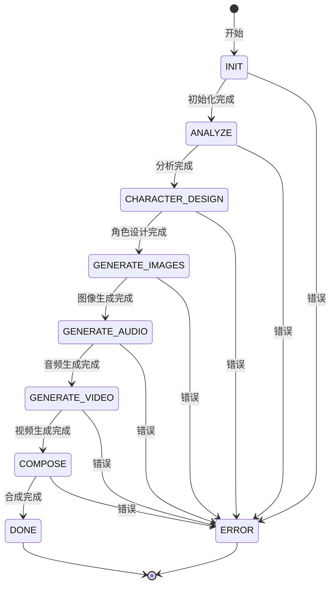
```mermaid
stateDiagram-v2
    [*] --> INIT: 开始
    INIT --> ANALYZE: 初始化完成
    ANALYZE --> CHARACTER_DESIGN: 分析完成
    CHARACTER_DESIGN --> GENERATE_IMAGES: 角色设计完成
    GENERATE_IMAGES --> GENERATE_AUDIO: 图像生成完成
    GENERATE_AUDIO --> GENERATE_VIDEO: 音频生成完成
    GENERATE_VIDEO --> COMPOSE: 视频生成完成
    COMPOSE --> DONE: 合成完成
    
    INIT --> ERROR: 错误
    ANALYZE --> ERROR: 错误
    CHARACTER_DESIGN --> ERROR: 错误
    GENERATE_IMAGES --> ERROR: 错误
    GENERATE_AUDIO --> ERROR: 错误
    GENERATE_VIDEO --> ERROR: 错误
    COMPOSE --> ERROR: 错误
    
    DONE --> [*]
    ERROR --> [*]
```

#### 4.1.2 PipelineController (主控制器)

```python
class PipelineController:
    """主流程控制器 - 编排整个视频生成流程"""
    
    # 核心职责:
    # 1. 初始化和管理各个模块实例
    # 2. 按阶段顺序执行生成流程
    # 3. 管理状态持久化和断点续传
    # 4. 处理错误和失败场景
    # 5. 提供进度回调
    
    # 关键方法:
    # - run(resume=True): 执行完整流程
    # - run_phase(phase): 执行单个阶段
    # - run_parallel(resume=True): 并行模式执行
```

#### 4.1.3 PipelineState (状态管理)

```python
@dataclass
class PipelineState:
    """Pipeline状态数据"""
    current_phase: Phase          # 当前阶段
    current_scene_index: int      # 当前场景索引
    total_scenes: int             # 总场景数
    completed_scenes: Dict[str, List[str]]  # 已完成场景 {task_type: [scene_ids]}
    errors: List[Dict[str, Any]]  # 错误记录
    created_at: str               # 创建时间
    updated_at: str               # 更新时间
```

#### 4.1.4 ParallelTaskScheduler (并行调度器)

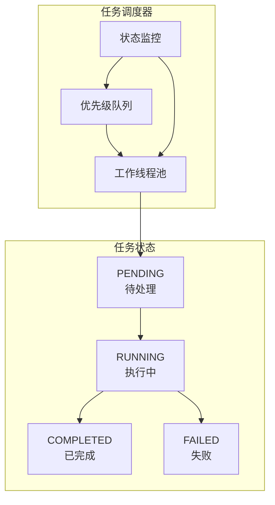
```mermaid
graph TB
    subgraph "任务调度器"
        Queue[优先级队列]
        Workers[工作线程池]
        Monitor[状态监控]
    end

    subgraph "任务状态"
        Pending[PENDING<br/>待处理]
        Running[RUNNING<br/>执行中]
        Completed[COMPLETED<br/>已完成]
        Failed[FAILED<br/>失败]
    end

    Queue --> Workers
    Workers --> Pending
    Pending --> Running
    Running --> Completed
    Running --> Failed
    
    Monitor --> Queue
    Monitor --> Workers
```

### 4.2 LLM模块

#### 4.2.1 模块结构

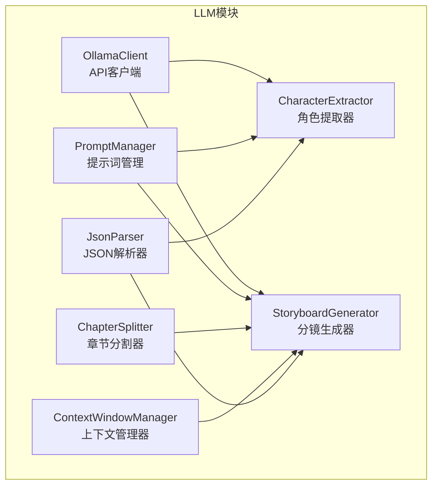
```mermaid
graph TB
    subgraph "LLM模块"
        Client[OllamaClient<br/>API客户端]
        CharExtractor[CharacterExtractor<br/>角色提取器]
        StoryGen[StoryboardGenerator<br/>分镜生成器]
        ChapterSplit[ChapterSplitter<br/>章节分割器]
        ContextMgr[ContextWindowManager<br/>上下文管理器]
        PromptMgr[PromptManager<br/>提示词管理]
        JsonParser[JsonParser<br/>JSON解析器]
    end

    Client --> CharExtractor
    Client --> StoryGen
    PromptMgr --> CharExtractor
    PromptMgr --> StoryGen
    ChapterSplit --> StoryGen
    ContextMgr --> StoryGen
    JsonParser --> CharExtractor
    JsonParser --> StoryGen
```

#### 4.2.2 角色提取流程

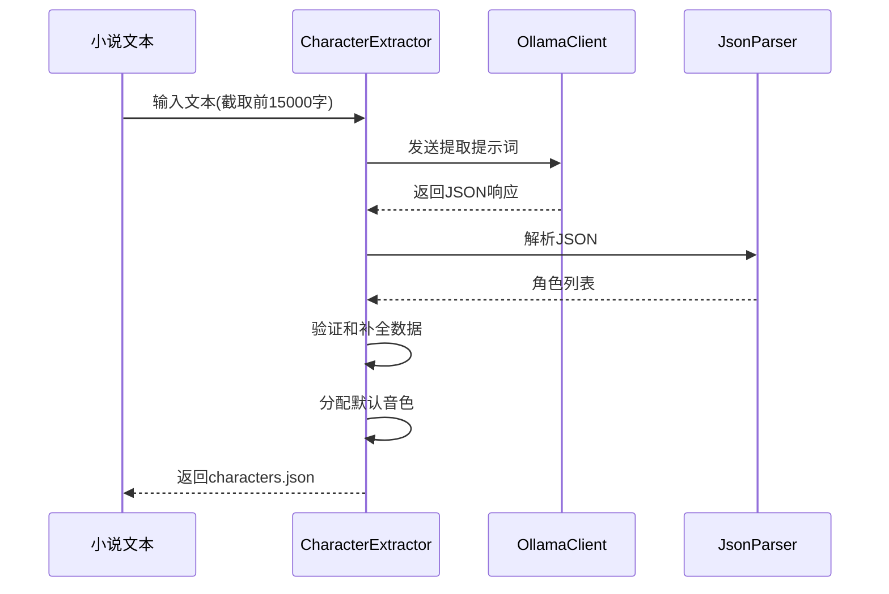
```mermaid
sequenceDiagram
    participant Novel as 小说文本
    participant Extractor as CharacterExtractor
    participant LLM as OllamaClient
    participant Parser as JsonParser

    Novel->>Extractor: 输入文本(截取前15000字)
    Extractor->>LLM: 发送提取提示词
    LLM-->>Extractor: 返回JSON响应
    Extractor->>Parser: 解析JSON
    Parser-->>Extractor: 角色列表
    Extractor->>Extractor: 验证和补全数据
    Extractor->>Extractor: 分配默认音色
    Extractor-->>Novel: 返回characters.json
```

#### 4.2.3 分镜生成流程

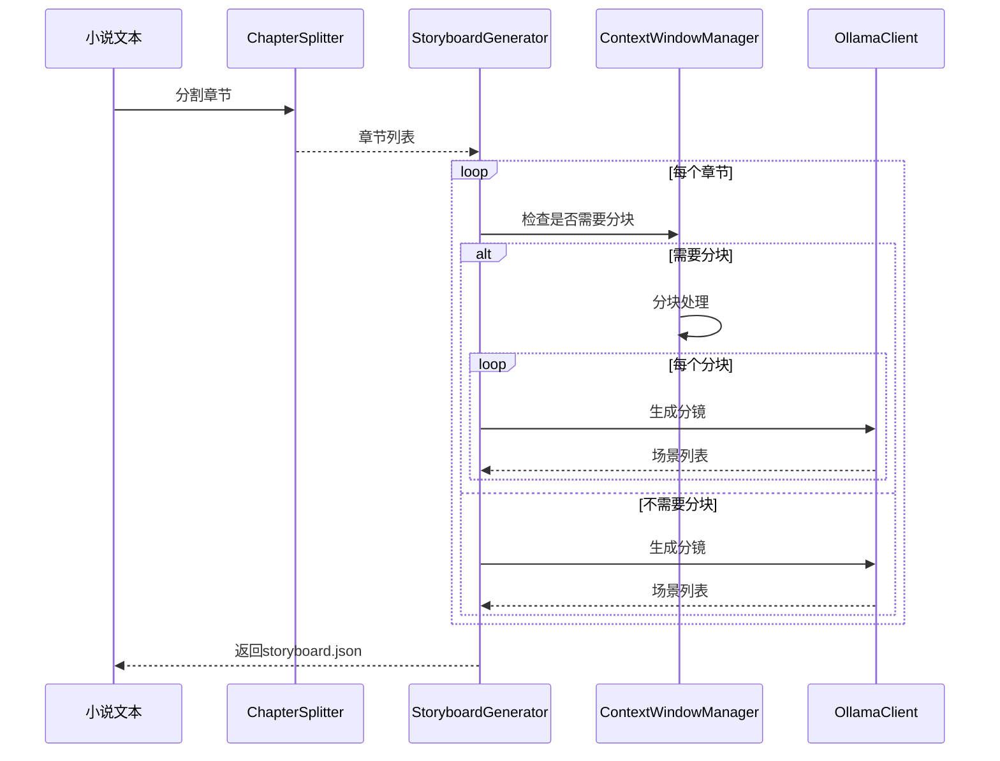
```mermaid
sequenceDiagram
    participant Novel as 小说文本
    participant Splitter as ChapterSplitter
    participant Generator as StoryboardGenerator
    participant Context as ContextWindowManager
    participant LLM as OllamaClient

    Novel->>Splitter: 分割章节
    Splitter-->>Generator: 章节列表
    
    loop 每个章节
        Generator->>Context: 检查是否需要分块
        alt 需要分块
            Context->>Context: 分块处理
            loop 每个分块
                Generator->>LLM: 生成分镜
                LLM-->>Generator: 场景列表
            end
        else 不需要分块
            Generator->>LLM: 生成分镜
            LLM-->>Generator: 场景列表
        end
    end
    
    Generator-->>Novel: 返回storyboard.json
```

#### 4.2.4 章节分割策略

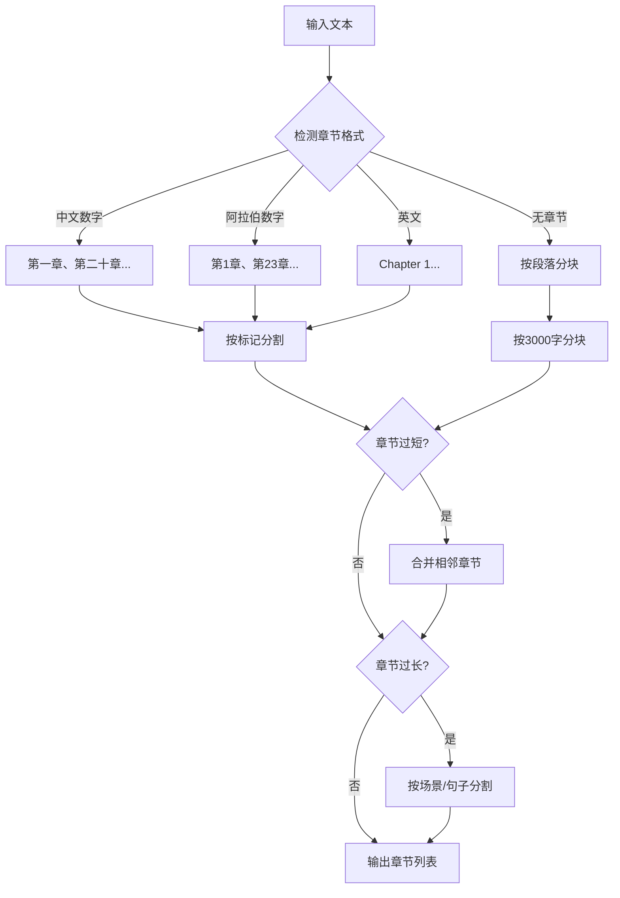
```mermaid
flowchart TD
    Input[输入文本] --> Detect{检测章节格式}
    
    Detect -->|中文数字| Chinese[第一章、第二十章...]
    Detect -->|阿拉伯数字| Arabic[第1章、第23章...]
    Detect -->|英文| English[Chapter 1...]
    Detect -->|无章节| NoChapter[按段落分块]
    
    Chinese --> Split[按标记分割]
    Arabic --> Split
    English --> Split
    NoChapter --> Paragraph[按3000字分块]
    
    Split --> Merge{章节过短?}
    Paragraph --> Merge
    
    Merge -->|是| MergeChapters[合并相邻章节]
    Merge -->|否| LongCheck{章节过长?}
    
    MergeChapters --> LongCheck
    
    LongCheck -->|是| SplitLong[按场景/句子分割]
    LongCheck -->|否| Output[输出章节列表]
    
    SplitLong --> Output
```

### 4.3 图像生成模块

#### 4.3.1 模块结构

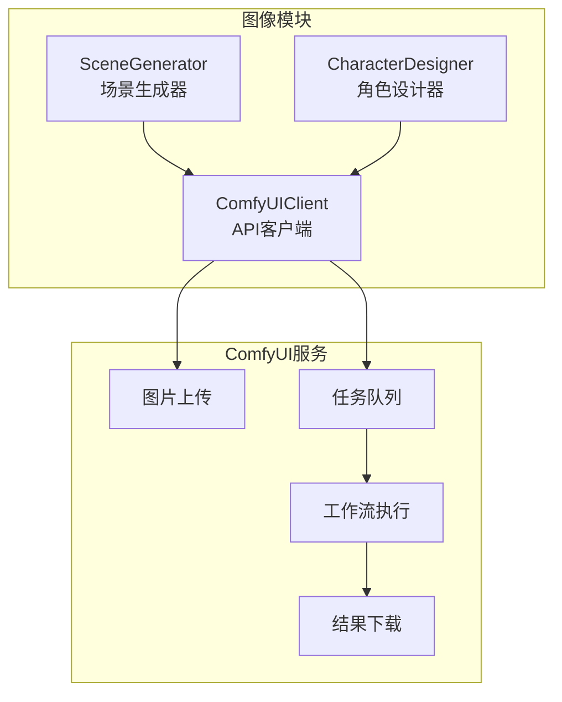
```mermaid
graph TB
    subgraph "图像模块"
        ComfyClient[ComfyUIClient<br/>API客户端]
        SceneGen[SceneGenerator<br/>场景生成器]
        CharDesigner[CharacterDesigner<br/>角色设计器]
    end

    subgraph "ComfyUI服务"
        Upload[图片上传]
        Queue[任务队列]
        Execute[工作流执行]
        Download[结果下载]
    end

    SceneGen --> ComfyClient
    CharDesigner --> ComfyClient
    
    ComfyClient --> Upload
    ComfyClient --> Queue
    Queue --> Execute
    Execute --> Download
```

#### 4.3.2 场景图生成流程

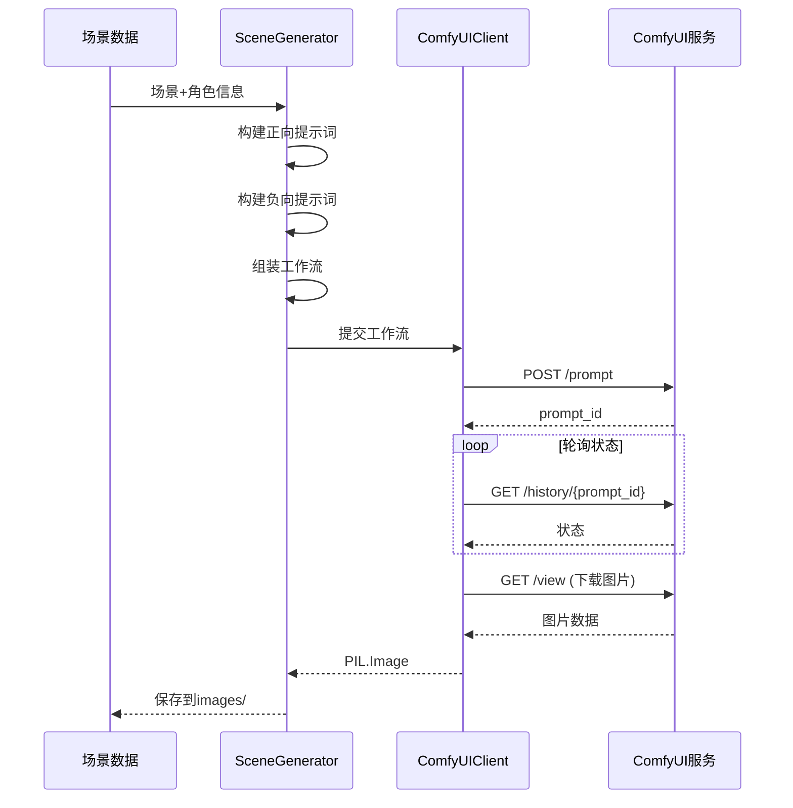
```mermaid
sequenceDiagram
    participant Scene as 场景数据
    participant Gen as SceneGenerator
    participant Client as ComfyUIClient
    participant ComfyUI as ComfyUI服务

    Scene->>Gen: 场景+角色信息
    Gen->>Gen: 构建正向提示词
    Gen->>Gen: 构建负向提示词
    Gen->>Gen: 组装工作流
    Gen->>Client: 提交工作流
    Client->>ComfyUI: POST /prompt
    ComfyUI-->>Client: prompt_id
    
    loop 轮询状态
        Client->>ComfyUI: GET /history/{prompt_id}
        ComfyUI-->>Client: 状态
    end
    
    Client->>ComfyUI: GET /view (下载图片)
    ComfyUI-->>Client: 图片数据
    Client-->>Gen: PIL.Image
    Gen-->>Scene: 保存到images/
```

#### 4.3.3 提示词构建策略

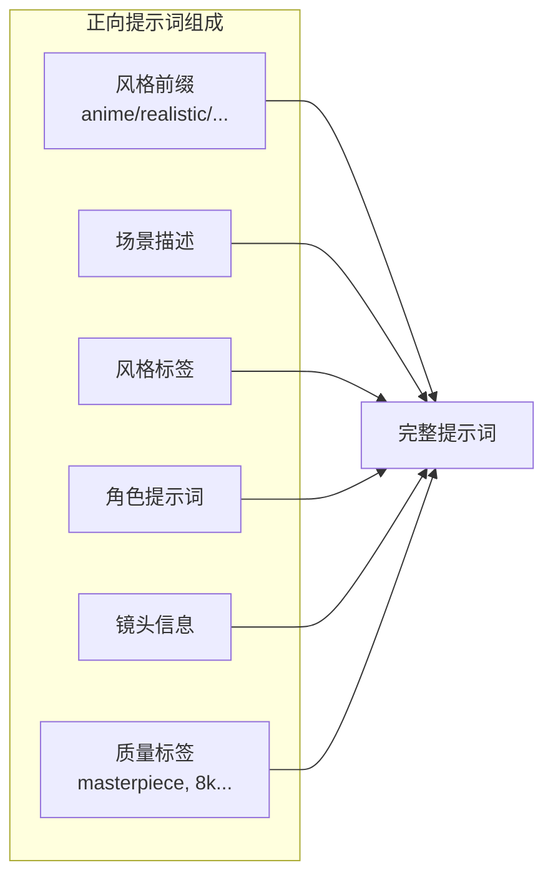
```mermaid
flowchart LR
    subgraph "正向提示词组成"
        Style[风格前缀<br/>anime/realistic/...]
        Desc[场景描述]
        Tags[风格标签]
        Chars[角色提示词]
        Camera[镜头信息]
        Quality[质量标签<br/>masterpiece, 8k...]
    end

    Style --> Prompt[完整提示词]
    Desc --> Prompt
    Tags --> Prompt
    Chars --> Prompt
    Camera --> Prompt
    Quality --> Prompt
```

### 4.4 视频生成模块

#### 4.4.1 模块结构

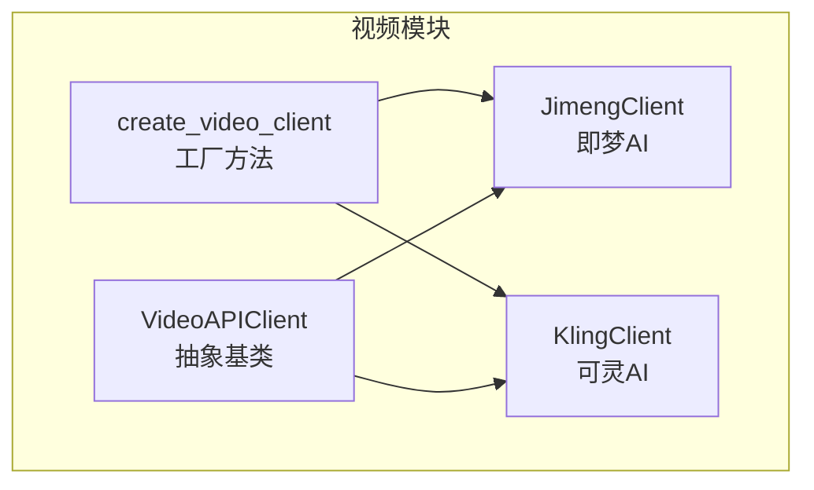
```mermaid
graph TB
    subgraph "视频模块"
        Factory[create_video_client<br/>工厂方法]
        BaseClient[VideoAPIClient<br/>抽象基类]
        Jimeng[JimengClient<br/>即梦AI]
        Kling[KlingClient<br/>可灵AI]
    end

    Factory --> Jimeng
    Factory --> Kling
    BaseClient --> Jimeng
    BaseClient --> Kling
```

#### 4.4.2 视频生成流程

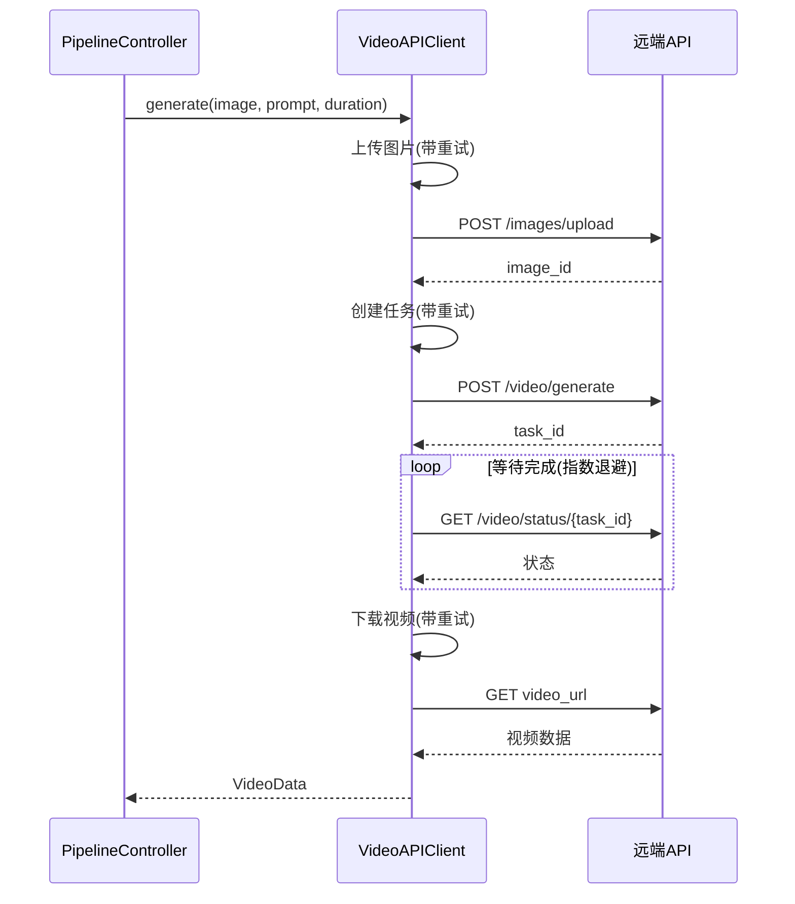
```mermaid
sequenceDiagram
    participant Controller as PipelineController
    participant Client as VideoAPIClient
    participant API as 远端API

    Controller->>Client: generate(image, prompt, duration)
    Client->>Client: 上传图片(带重试)
    Client->>API: POST /images/upload
    API-->>Client: image_id
    
    Client->>Client: 创建任务(带重试)
    Client->>API: POST /video/generate
    API-->>Client: task_id
    
    loop 等待完成(指数退避)
        Client->>API: GET /video/status/{task_id}
        API-->>Client: 状态
    end
    
    Client->>Client: 下载视频(带重试)
    Client->>API: GET video_url
    API-->>Client: 视频数据
    
    Client-->>Controller: VideoData
```

### 4.5 TTS语音合成模块

#### 4.5.1 模块结构

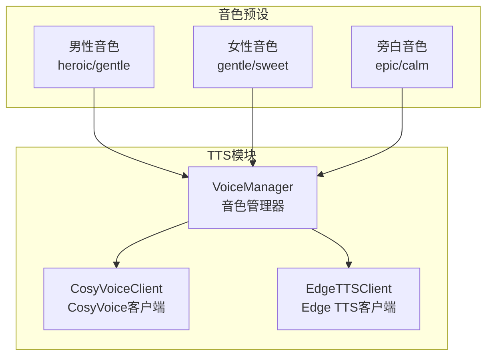
```mermaid
graph TB
    subgraph "TTS模块"
        CosyVoice[CosyVoiceClient<br/>CosyVoice客户端]
        EdgeTTS[EdgeTTSClient<br/>Edge TTS客户端]
        VoiceMgr[VoiceManager<br/>音色管理器]
    end

    subgraph "音色预设"
        Male[男性音色<br/>heroic/gentle]
        Female[女性音色<br/>gentle/sweet]
        Narrator[旁白音色<br/>epic/calm]
    end

    VoiceMgr --> CosyVoice
    VoiceMgr --> EdgeTTS
    Male --> VoiceMgr
    Female --> VoiceMgr
    Narrator --> VoiceMgr
```

#### 4.5.2 场景音频生成流程

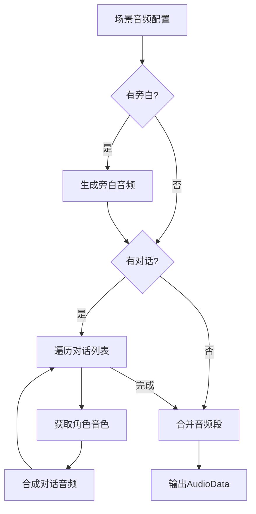
```mermaid
flowchart TD
    Scene[场景音频配置] --> Check{有旁白?}
    
    Check -->|是| Narration[生成旁白音频]
    Check -->|否| Dialogue
    
    Narration --> Dialogue{有对话?}
    
    Dialogue -->|是| Loop[遍历对话列表]
    Dialogue -->|否| Merge
    
    Loop --> GetVoice[获取角色音色]
    GetVoice --> Synthesize[合成对话音频]
    Synthesize --> Loop
    Loop -->|完成| Merge[合并音频段]
    
    Merge --> Output[输出AudioData]
```

### 4.6 视频合成模块

#### 4.6.1 模块结构

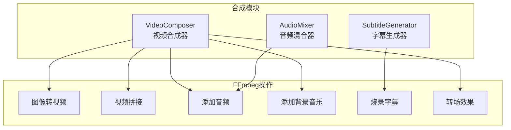
```mermaid
graph TB
    subgraph "合成模块"
        Composer[VideoComposer<br/>视频合成器]
        SubGen[SubtitleGenerator<br/>字幕生成器]
        AudioMixer[AudioMixer<br/>音频混合器]
    end

    subgraph "FFmpeg操作"
        ImgToVideo[图像转视频]
        Concat[视频拼接]
        AddAudio[添加音频]
        AddBGM[添加背景音乐]
        AddSub[烧录字幕]
        Transition[转场效果]
    end

    Composer --> ImgToVideo
    Composer --> Concat
    Composer --> AddAudio
    Composer --> AddBGM
    Composer --> Transition
    SubGen --> AddSub
    AudioMixer --> AddAudio
```

#### 4.6.2 视频合成流程

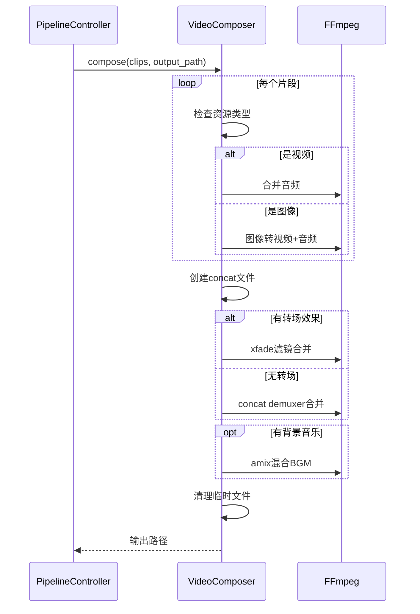
```mermaid
sequenceDiagram
    participant Controller as PipelineController
    participant Composer as VideoComposer
    participant FFmpeg as FFmpeg

    Controller->>Composer: compose(clips, output_path)
    
    loop 每个片段
        Composer->>Composer: 检查资源类型
        alt 是视频
            Composer->>FFmpeg: 合并音频
        else 是图像
            Composer->>FFmpeg: 图像转视频+音频
        end
    end
    
    Composer->>Composer: 创建concat文件
    
    alt 有转场效果
        Composer->>FFmpeg: xfade滤镜合并
    else 无转场
        Composer->>FFmpeg: concat demuxer合并
    end
    
    opt 有背景音乐
        Composer->>FFmpeg: amix混合BGM
    end
    
    Composer->>Composer: 清理临时文件
    Composer-->>Controller: 输出路径
```

---

## 5. 数据结构定义

### 5.1 角色数据 (characters.json)

```json
{
  "characters": [
    {
      "id": "char_001",
      "name": "李逍遥",
      "aliases": ["逍遥", "李大侠"],
      "appearance": {
        "gender": "male",
        "hair": "black long hair",
        "eyes": "brown eyes",
        "clothing": "white hanfu robe",
        "features": "handsome young man"
      },
      "sd_prompt": "1boy, black long hair, brown eyes, white hanfu robe, handsome",
      "sd_negative": "ugly, deformed, bad anatomy",
      "voice": {
        "provider": "cosyvoice",
        "voice_id": "male_heroic",
        "speed": 1.0,
        "pitch": 0
      }
    }
  ],
  "narrator": {
    "voice": {
      "provider": "cosyvoice",
      "voice_id": "narrator_epic",
      "speed": 0.95,
      "pitch": -2
    }
  }
}
```

### 5.2 分镜数据 (storyboard.json)

```json
{
  "novel_title": "仙剑奇侠传",
  "total_scenes": 50,
  "total_chapters": 5,
  "characters": [...],
  "scenes": [
    {
      "id": "scene_01_001",
      "chapter": 1,
      "sequence": 1,
      "global_index": 1,
      "duration": 5.0,
      "visual": {
        "description": "清晨的余杭镇，薄雾笼罩着青石板街道",
        "style_tags": ["morning", "misty", "ancient town"],
        "characters_in_scene": ["char_001"],
        "camera": {
          "type": "pan",
          "start_frame": "wide_shot",
          "end_frame": "medium_shot"
        }
      },
      "audio": {
        "narration": {
          "text": "故事发生在一个宁静的清晨...",
          "emotion": "calm"
        },
        "dialogues": [
          {
            "character_id": "char_001",
            "text": "今天天气真好啊",
            "emotion": "happy"
          }
        ],
        "bgm": "peaceful",
        "sfx": ["birds", "wind"]
      },
      "subtitle": {
        "text": "故事发生在一个宁静的清晨...",
        "style": "narration",
        "character": null
      },
      "generation_status": {
        "image": "completed",
        "video": "pending",
        "audio": "completed"
      }
    }
  ]
}
```

### 5.3 Pipeline状态 (pipeline_state.json)

```json
{
  "phase": "generate_images",
  "scene_index": 15,
  "total_scenes": 50,
  "completed_scenes": {
    "character": ["char_001", "char_002"],
    "image": ["scene_01_001", "scene_01_002", "..."],
    "audio": ["scene_01_001", "scene_01_002", "..."],
    "video": []
  },
  "errors": [
    {
      "phase": "generate_images",
      "scene_id": "scene_01_010",
      "message": "ComfyUI连接超时",
      "time": "2024-01-15T10:30:00"
    }
  ],
  "created_at": "2024-01-15T09:00:00",
  "updated_at": "2024-01-15T10:35:00"
}
```

---

## 6. 配置系统

### 6.1 配置层次

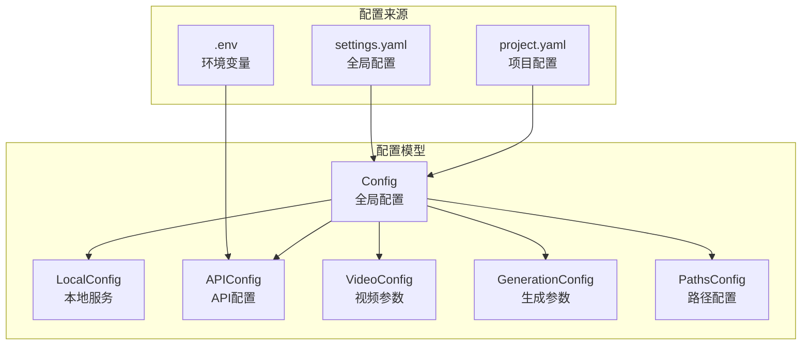
```mermaid
graph TB
    subgraph "配置来源"
        YAML[settings.yaml<br/>全局配置]
        ENV[.env<br/>环境变量]
        Project[project.yaml<br/>项目配置]
    end

    subgraph "配置模型"
        Config[Config<br/>全局配置]
        LocalConfig[LocalConfig<br/>本地服务]
        APIConfig[APIConfig<br/>API配置]
        VideoConfig[VideoConfig<br/>视频参数]
        GenConfig[GenerationConfig<br/>生成参数]
        PathsConfig[PathsConfig<br/>路径配置]
    end

    YAML --> Config
    ENV --> APIConfig
    Project --> Config
    
    Config --> LocalConfig
    Config --> APIConfig
    Config --> VideoConfig
    Config --> GenConfig
    Config --> PathsConfig
```

### 6.2 配置项说明

| 配置项 | 类型 | 默认值 | 说明 |
|--------|------|--------|------|
| local.ollama_url | str | http://localhost:11434 | Ollama服务地址 |
| local.ollama_model | str | glm4:9b | LLM模型名称 |
| local.comfyui_url | str | http://localhost:8188 | ComfyUI服务地址 |
| local.cosyvoice_url | str | http://localhost:9880 | CosyVoice服务地址 |
| api.video_provider | str | jimeng | 视频API提供商 |
| api.use_idle_time | bool | true | 使用闲时折扣 |
| video.resolution | str | 1280x720 | 视频分辨率 |
| video.fps | int | 24 | 视频帧率 |
| video.style | str | anime | 默认风格 |
| generation.max_concurrent_tasks | int | 3 | 最大并发任务数 |
| generation.retry_count | int | 3 | 重试次数 |

---

## 7. 错误处理与重试机制

### 7.1 重试策略

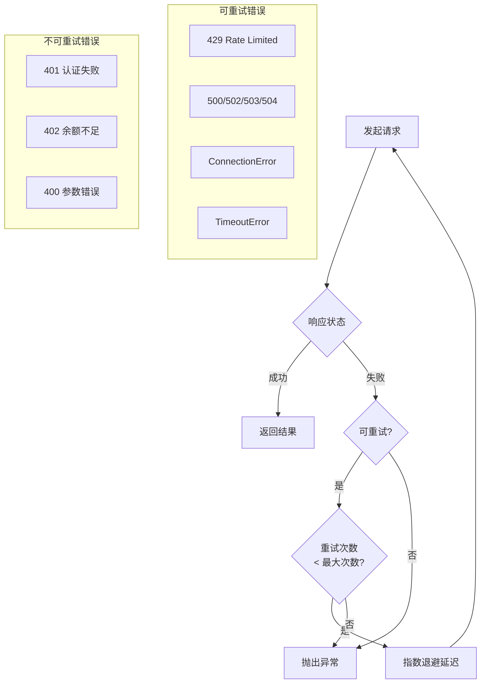
```mermaid
flowchart TD
    Request[发起请求] --> Response{响应状态}
    
    Response -->|成功| Success[返回结果]
    Response -->|失败| CheckRetry{可重试?}
    
    CheckRetry -->|是| CheckCount{重试次数<br/>< 最大次数?}
    CheckRetry -->|否| Fail[抛出异常]
    
    CheckCount -->|是| Delay[指数退避延迟]
    CheckCount -->|否| Fail
    
    Delay --> Request
    
    subgraph "可重试错误"
        R1[429 Rate Limited]
        R2[500/502/503/504]
        R3[ConnectionError]
        R4[TimeoutError]
    end
    
    subgraph "不可重试错误"
        N1[401 认证失败]
        N2[402 余额不足]
        N3[400 参数错误]
    end
```

### 7.2 失败场景处理

```python
# 控制器配置
controller.skip_failed_scenes = True   # 跳过失败场景继续执行
controller.failure_threshold = 0.5     # 失败率超过50%时停止
```

---

## 8. WebUI界面架构

### 8.1 界面结构

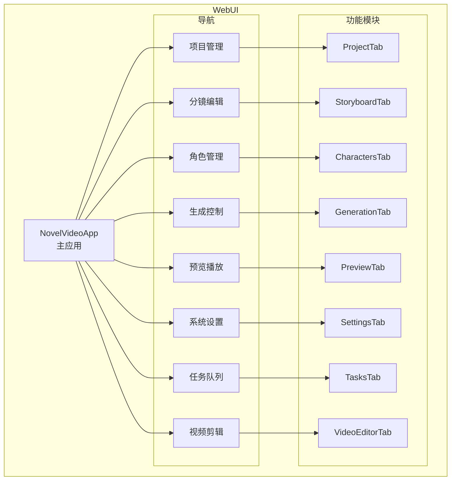
```mermaid
graph TB
    subgraph "WebUI"
        App[NovelVideoApp<br/>主应用]
        
        subgraph "导航"
            Nav1[项目管理]
            Nav2[分镜编辑]
            Nav3[角色管理]
            Nav4[生成控制]
            Nav5[预览播放]
            Nav6[系统设置]
            Nav7[任务队列]
            Nav8[视频剪辑]
        end
        
        subgraph "功能模块"
            ProjectTab[ProjectTab]
            StoryboardTab[StoryboardTab]
            CharactersTab[CharactersTab]
            GenerationTab[GenerationTab]
            PreviewTab[PreviewTab]
            SettingsTab[SettingsTab]
            TasksTab[TasksTab]
            EditorTab[VideoEditorTab]
        end
    end

    App --> Nav1 --> ProjectTab
    App --> Nav2 --> StoryboardTab
    App --> Nav3 --> CharactersTab
    App --> Nav4 --> GenerationTab
    App --> Nav5 --> PreviewTab
    App --> Nav6 --> SettingsTab
    App --> Nav7 --> TasksTab
    App --> Nav8 --> EditorTab
```

---

## 9. 扩展指南

### 9.1 添加新的视频API提供商

1. 在 `src/video/` 创建新客户端类
2. 继承 `VideoAPIClient` 抽象基类
3. 实现 `generate()` 和 `check_status()` 方法
4. 在 `api_client.py` 的工厂方法中注册

### 9.2 添加新的TTS提供商

1. 在 `src/tts/` 创建新客户端类
2. 实现 `synthesize()` 和 `generate_scene_audio()` 方法
3. 在 `__init__.py` 中导出

### 9.3 自定义ComfyUI工作流

1. 在ComfyUI中设计工作流并导出JSON
2. 保存到 `config/comfyui_workflows/`
3. 在 `SceneGenerator` 初始化时指定工作流路径

---

## 10. 性能优化建议

1. **并行处理**: 使用 `--parallel` 参数启用图像和音频并行生成
2. **显存管理**: 每个阶段完成后自动清理CUDA缓存
3. **断点续传**: 状态实时持久化，支持任意时刻恢复
4. **批量操作**: WebUI支持批量重新生成和状态重置
5. **闲时调度**: 视频API支持闲时折扣模式

---

*文档版本: 1.0.0*
*最后更新: 2024-01*
